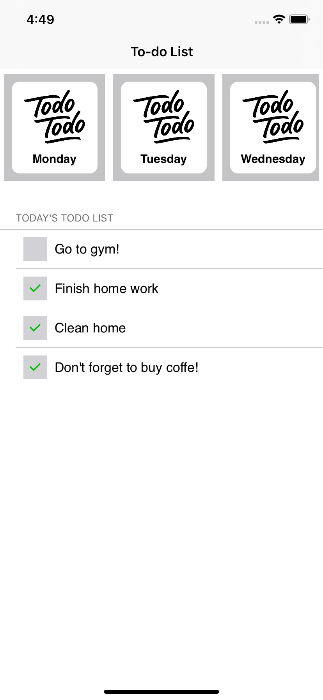

# Today (Todo List)

This is an example project to show my knowledge about iOS Development. I use VIP(Clean Swift) structure to build the project and I add Unit Test for all scenes.

## Screenshots

